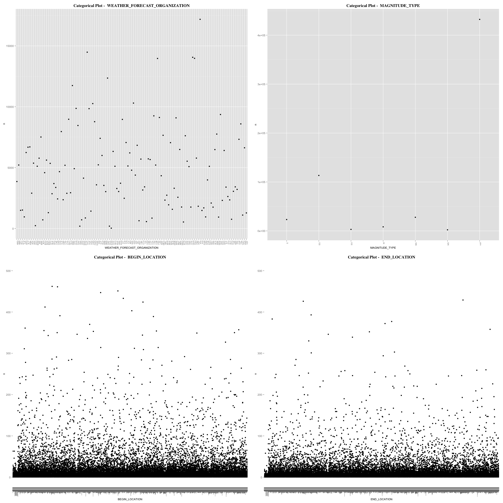
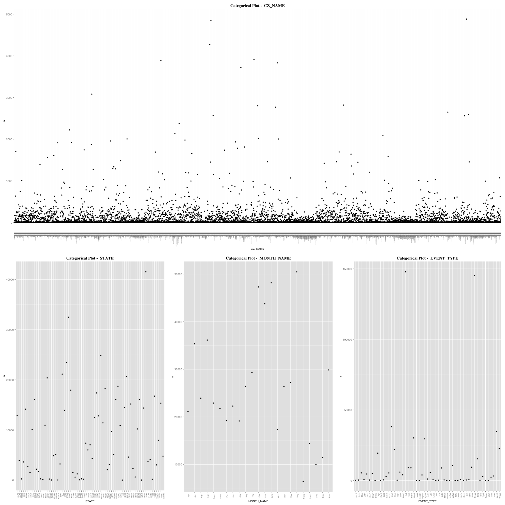

Elements Of Data Visualization: Project 3, Sattelite Analysis
===

***

__By Jose Cortez, Adam Hernandex, and Alex Pearce__

__GitHub__: https://github.com/alexpearce92/DV_RProject3

This project deals with creating interesting graphs concerning climactic weather in the US in 2010, the data of which was gathered and compiled by [Enigma](https://app.enigma.io/search/source/us.gov.noaa.ncdc.stormevents). Included are three datasets that were joined to form a single large data frame: satellite payload, satellite launch information, and satellite national origin.

## Load necessary packages
```{r message=FALSE}
source("../01 Data/load_packages.R",echo=TRUE)
```

## Dataframe Creations
```{r message=FALSE}
source("../01 Data/create_df.R",echo=TRUE)
```

***

## Plotting the destruction of each type of storm

Here we will perform a left outer join of two datasets so that we may determine the destructive damage of each type of storm over time.

## Create the data set using an outer join
```{r message=FALSE}
source("../02 Data Wrangling/impact_per_year.R", echo=TRUE)
```

## Plot each storm's deaths and injuries

Below we see plots of each storms deaths and injuries each year. According to the dataset, the deadliest storm was a heat wave in 2006. Injuries, however, have large spikes in excessive heat (2007), heat (2006), hyrricane/typhoons (2008) and tornado (2008) storms. Although hurricane Katrina has the highest casualty count in US history of any storm, this data is missing from the 2005 data set provided by Enigma. 
```{r message=FALSE, fig.width=12, fig.height=25}
source("../03 Visualizations/deaths_per_year_plot.R", echo=TRUE)
```

Here we compare the damage to property and crops of each storm. Note that damage is measured in millions of US dollars. According to the plots below, it appears that the most devastating storms for property and crops were floods (2006), followed by Hurricanes and Storm Surges (2005). Like we found above, much of the data from Hurricane Katrina is missing from this data set, which is why the 2005 event in hurricanes is not dwarfing that of the 2006 flood.
```{r message=FALSE, fig.width=12, fig.height=25}
source("../03 Visualizations/damage_per_year_plot.R", echo=TRUE)
```

***
## Torando Analysis

Next, we'll take a look at the destructive cost and lethality of tornados.

## Data Wrangling with an inner-join

We will perform an inner join so that we can plot the destructive cost, deaths, and the date of each storm.

```{r message=FALSE}
source("../02 Data Wrangling/tornados.R", echo=TRUE)
```

## Visualization

From 2000-2011, there were numerous tornadoes that produced few injuries or deaths; however, many of these tornadoes created a large amount of damage to property and crops. Among the most costly storms in terms of damage, the most deaths and injuries also occured.

```{r message=FALSE, fig.width=12, fig.height=10}
source("../03 Visualizations/state_tornados.R", echo=TRUE)
```

Below we see that the destruction during Spring is the greatest as expected, yet the winters of 2000 - 2011 seemed to be particularly deadly. 
```{r message=FALSE, fig.width=12, fig.height=10}
source("../03 Visualizations/season_tornados.R", echo=TRUE)
```
***

## Individual State Analysis

To study individual states we built a new dataframe via select statements on the original dataframes and combined the results with the bind_rows operation. We chose to study Texas, California, and Florida and the weather events that took place in each of these states. The new dataframe and the code written to build it is shown below:

```{r message=FALSE}
source("../02 Data Wrangling/state.R",echo=TRUE)
```

## Individual State Visualizations

We have produced two plots: one which shows the number of occurrences of each weather event for each state where there are less than 1000 occurrences, and another where there are more than 1000 occurrences. It can be seen that purely in terms of weather occurrences, Texas had the most.

```{r message=FALSE, fig.width=12, fig.height=10}
source("../03 Visualizations/state_plot_under.R", echo=TRUE)
```

```{r message=FALSE, fig.width=12, fig.height=10}
source("../03 Visualizations/state_plot_over.R", echo=TRUE)
```

***

# Categorical Statistics

We will now generate a characterization of the categorical columns represented in the tables

## Generate lists of categorical and numerical columns
```{r message=FALSE}
source("../01 Data/create_categoricals.R",echo=TRUE)
```

## Create characterization and generate png file for each table

Notice that StormImpact does not generate any categorical plots because it only contains numerical columns
```{r message=FALSE}
source("../03 Visualizations/storm_impact_categoricals.R",echo=TRUE)
source("../03 Visualizations/storm_meta_categoricals.R",echo=TRUE)
source("../03 Visualizations/storm_path_categoricals.R",echo=TRUE)
```

## And here are the png files that we created

### StormPath Categoricals


### StormMeta Categoricals

